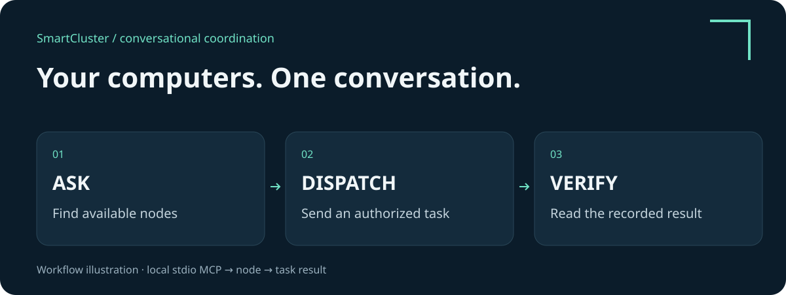
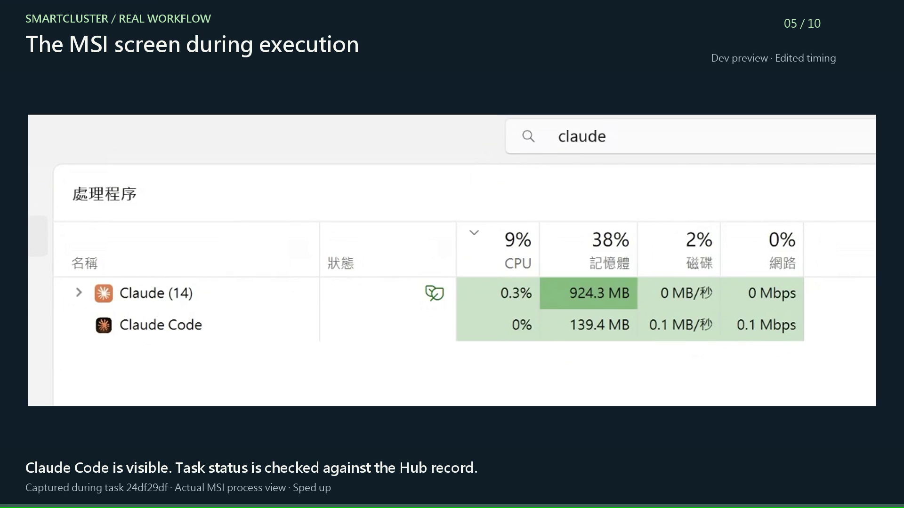

# SmartCluster

### Coordinate work across computers, from your AI conversation.

[繁體中文](README.zh-TW.md) · **English**

Ask which computers are available. Send a task to an authorized Claude or Codex CLI. Follow its progress and read the result—all through SmartCluster MCP in a compatible AI client.

**A conversation is the starting point. A recorded result is the proof.**

- **Act from chat.** Query nodes, submit tasks, check results, and use supported service and invitation tools.
- **Organize your groups.** Create or join separate groups, with independent state and permissions. Choose which group accepts new work.
- **Keep work traceable.** See task status and results in the console. An App job that is queued is clearly different from one that has completed.

## Start here

**Development preview candidate: 0.11.0.dev3, Windows x64.** [Download the Windows x64 trial ZIP](https://github.com/shlee1615/smartcluster-preview/releases/download/v0.11.0.dev3/SmartCluster-0.11.0.dev3-windows-x64-preview.zip) · [Release notes and checksums](https://github.com/shlee1615/smartcluster-preview/releases/tag/v0.11.0.dev3). The candidate is unsigned and has not passed clean-machine release acceptance. See [release status](docs/RELEASE_NOTES.en.md) before planning a trial.

1. [Read the user guide](docs/USER_GUIDE.en.md): first launch, groups, MCP, and your first completed task.
2. [Check the FAQ](docs/FAQ.en.md): AI accounts, permissions, App intake, and recovery.
3. [Plan a remote connection](docs/WAN.en.md): customer-managed networking and the current test scope.

## Watch the 60-second demo

[English video](media/SmartCluster-MSI-demo-v3.en.mp4) · [繁體中文 video](media/SmartCluster-MSI-demo-v3.zh-TW.mp4) · [Scene-by-scene explanation and prompts](docs/DEMO.en.md)

Follow a real run from the Hub node graph to a Mac conversation, the MSI process view, the returned review, and the Hub task history. Edited for length; background music, no narration. Some original OS labels remain Chinese. Five online nodes do not mean five executors. MSI footage shows Task Manager, not a live Claude conversation or execution terminal; task attribution comes from the Hub record. A visible execution interface is [planned for the next phase](docs/ROADMAP.en.md). The workflow graphic above is an illustration.

## A prompt you can try

After connecting the local stdio MCP server:

> Use SmartCluster to list this group's nodes. Send a no-AI connectivity diagnostic to the Windows Test Node, then report its final status and task ID.

Next, with a configured AI provider:

> Ask the enabled Claude CLI on Demo Mac to review this short product description. Track the task and return its result and task ID.

The second example uses the selected computer's AI account and allowance. Group membership does not share accounts or grant access to all files. Creating and switching groups currently uses the web interface.

## What has been demonstrated?

On September 28, 2026, a Mac mini M4 running the private source test build hosted a new group. A Windows executable joined over LAN. mTLS enrollment, diagnostic round trips, duplicate-request handling, and queued-task recovery after a node restart passed. This does not establish macOS executable support or current-version WAN release readiness. [Verification scope and known issues](docs/RELEASE_NOTES.en.md)

This repository is intended for documentation and media, with the executable trial distributed separately through Releases. No standalone Python source files are published; the EXE embeds readable web assets and Python bytecode. Packaging does not guarantee protection against reverse engineering. Product licensing and commercial support terms are not yet published.
