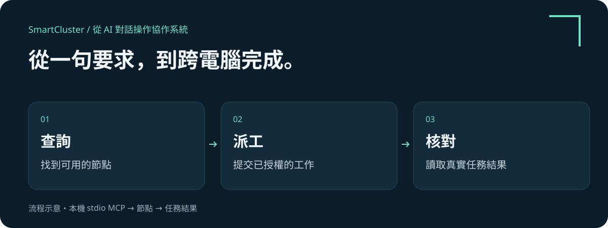

# 智慧集群 SmartCluster

### 從 AI 對話框，調度跨電腦工作。

**繁體中文** · [English](README.md)

詢問哪些電腦可以接單，把任務交給已授權的 Claude 或 Codex CLI，再追蹤進度與讀取結果。支援的 AI 客戶端接上 SmartCluster MCP 後，就能從對話中實際操作。

**從一句要求開始，以可查驗的結果完成。**

- **在對話中操作。** 查詢節點、提交工作、追蹤結果，以及使用已支援的服務與邀請工具。
- **分開管理不同群組。** 建立或加入多個群組，各自保存狀態與授權，選擇目前接新工作的群組。
- **讓工作有跡可循。** 在控制台查看任務狀態與結果，清楚區分 App 工作的「已提交」與「已完成」。

## 從這裡開始

**目前為 Windows x64 0.11.0.dev3 開發預覽候選版，已開放試用下載。**

[下載 Windows x64 試用 ZIP](https://github.com/shlee1615/smartcluster-preview/releases/download/v0.11.0.dev3/SmartCluster-0.11.0.dev3-windows-x64-preview.zip) · [版本與校驗碼](https://github.com/shlee1615/smartcluster-preview/releases/tag/v0.11.0.dev3)

候選版尚未簽署，也未通過乾淨機發佈驗收。試用前請先閱讀[版本狀態](docs/RELEASE_NOTES.zh-TW.md)。

1. [閱讀使用手冊](docs/USER_GUIDE.zh-TW.md)：首次啟動、群組、MCP 與第一個完成的任務。
2. [查看常見問題](docs/FAQ.zh-TW.md)：AI 帳號、授權、App 收件與恢復。
3. [規劃遠端連線](docs/WAN.zh-TW.md)：客戶管理的網路及目前驗證範圍。

## 觀看 60 秒展示

[中文字幕影片](media/SmartCluster-MSI-demo-v3.zh-TW.mp4) · [English video](media/SmartCluster-MSI-demo-v3.en.mp4) · [逐段解說與對話範例](docs/DEMO.zh-TW.md)

從 Hub 節點圖、Mac 對話、MSI 程序畫面，到回傳審閱結果及 Hub 任務紀錄，呈現真實流程的剪輯版。附背景音樂，沒有旁白；來源作業系統部分文字仍為中文。五個在線節點不代表五台同時執行。MSI 片段是工作管理員，不是 Claude 即時對話或執行終端；任務歸屬以 Hub 紀錄查驗。可見執行介面列入[下一階段](docs/ROADMAP.zh-TW.md)。上方流程圖為示意圖。

## 可以這樣對 AI 說

完成本機 stdio MCP 設定後：

> 請用 SmartCluster 列出這個群組的節點，向 Windows Test Node 送出不使用 AI 的連線診斷，並回報最終狀態與任務 ID。

已設定 AI provider 後，再試：

> 請讓 Demo Mac 上已啟用的 Claude CLI 審閱這段產品說明，追蹤任務並回傳結果與任務 ID。

第二個範例會使用目標電腦的 AI 帳號及額度。加入群組不會共用帳號，也不會自動開放所有檔案。建立與切換群組目前使用網頁介面。

## 已有哪些實測？

2026 年 9 月 28 日，以 Mac mini M4 的私有原始碼測試版建立新群，Windows 執行檔透過 LAN 加入。mTLS 配對、診斷往返、重複請求處理與節點重啟後的佇列恢復通過。這不代表 macOS 執行檔或新版 WAN 已達公開發佈標準。[驗證範圍與已知問題](docs/RELEASE_NOTES.zh-TW.md)

此目錄供公開文件及媒體使用；執行檔試用包由 Releases 另行提供。不另附 Python 原始檔，但 EXE 內含可讀網頁資產及 Python 位元組碼。執行檔封裝不保證無法逆向。產品授權及商業支援條款尚未公布。
