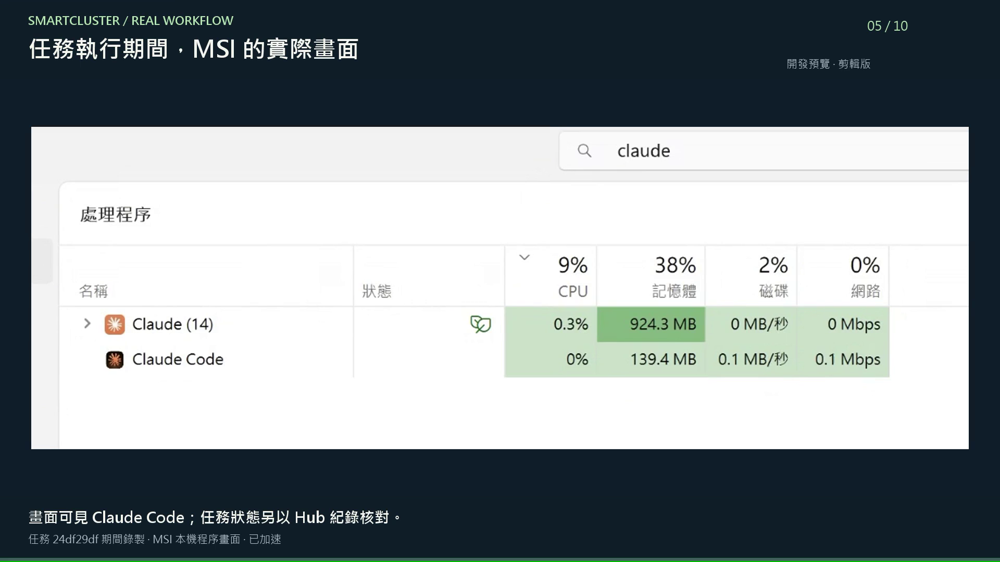

# 看懂這段展示

[首頁](../README.zh-TW.md) · [English](DEMO.en.md) · [設定手冊](USER_GUIDE.zh-TW.md)

[觀看中文字幕版](../media/SmartCluster-MSI-demo-v3.zh-TW.mp4) · [獨立字幕](../media/SmartCluster-MSI-demo-v3.zh-TW.srt)

這段實錄中，使用者在 Mac mini M4 的 Agent 對話請 MSI 上的 Claude 審閱文字。SmartCluster 透過 MCP 提交支援的任務，由目標電腦的官方 CLI 分析，再由發起對話取回結果。Hub 的任務紀錄提供執行節點及完成狀態的查驗依據。

## 60 秒逐段解說

| 時間 | 畫面 | 帶來的價值 |
|---|---|---|
| 0–6 秒 | Hub 節點圖：五個在線節點 | 掌握可用網路；本次只有 Mac 與 MSI 參與任務，不是五台一起執行。 |
| 6–10 秒 | 主對話透過 MCP 查節點的先前片段 | 在對話中查詢可用電腦；這個短片段早於後續新任務。 |
| 10–20 秒 | 輸入審閱虛構 Orbit 文案的要求 | 指定目標及具體工作，要求回傳三點建議。 |
| 20–37 秒 | MSI 桌面與 Windows 工作管理員 | 看見任務期間的目標電腦；程序名稱或活動本身不能證明某項任務身分或完成。 |
| 37–45 秒 | 主對話取回審閱結果 | 結果回到發起處，不需手動到目標電腦複製。 |
| 45–56 秒 | Hub 完成紀錄與歷史 | 核對發起端、執行節點、結果與交付。 |
| 56–60 秒 | 結尾 | 從對話派工，追蹤實際結果。 |

## 自己試一次

先依設定手冊連接正確 profile 的 MCP，完成不使用 AI 的診斷，再於目標電腦啟用及登入指定 AI provider。以下節點名稱請換成你的實際名稱：

> 請列出目前群組的節點與已啟用 AI provider，找出 Windows Test Node 並回報是否可接工作。

> 請讓 Windows Test Node 上的 Claude 審閱以下虛構產品文案，檢查清晰度及缺乏依據的宣稱，回傳短評與三點建議。不要修改檔案。追蹤至最終狀態並附任務 ID：[貼上範例文字]。

> 請取回該任務的最終結果；若失敗或仍排隊，回報實際狀態，不要假設已完成。

目標電腦的擁有者控制 provider 權限及帳號額度。診斷成功只代表連線測試通過，不等於 AI 已可用；任務可用工具取決於執行方式及既有授權。

## 展示範圍

中英文各 60 秒、1080p、30 fps，包含剪輯、標題、字幕與原創合成背景音樂，沒有口語旁白。來源作業系統部分文字仍為中文；英文版指英文標題及字幕版，不是全英文作業系統錄影。

MSI 畫面是程序檢視，沒有錄到 Claude 的即時對話或終端輸出，也沒有捕捉 PID 與任務的對照；任務歸屬以 Hub 紀錄查驗。剪接及加速片段不是效能測試，也不是不中斷的直播。Orbit 為虛構展示文案。

可見執行輸出列入[下一階段](ROADMAP.zh-TW.md)。本片展示開發環境，不代表已有公開 macOS 執行檔，也不代表畫面中所有節點及網路路徑均完成發佈驗收。
